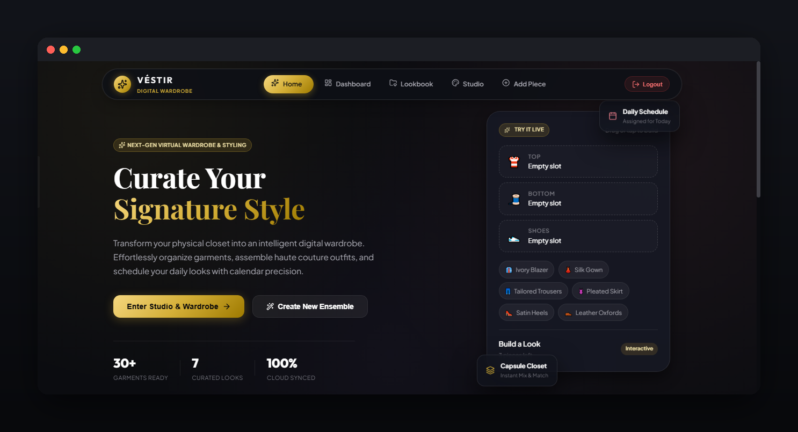
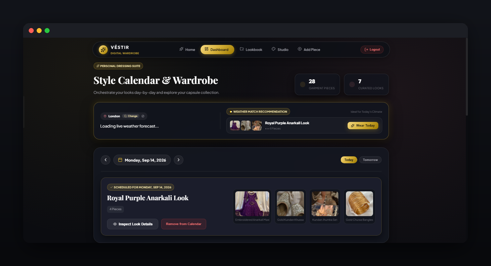
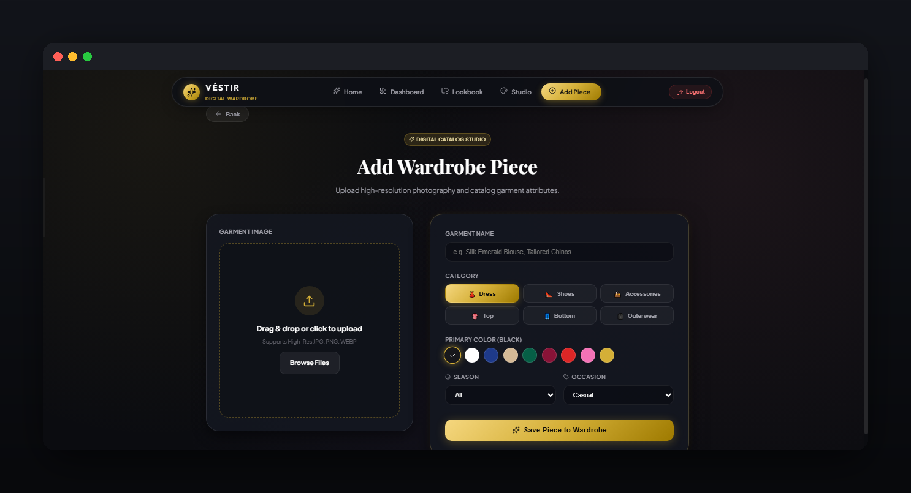
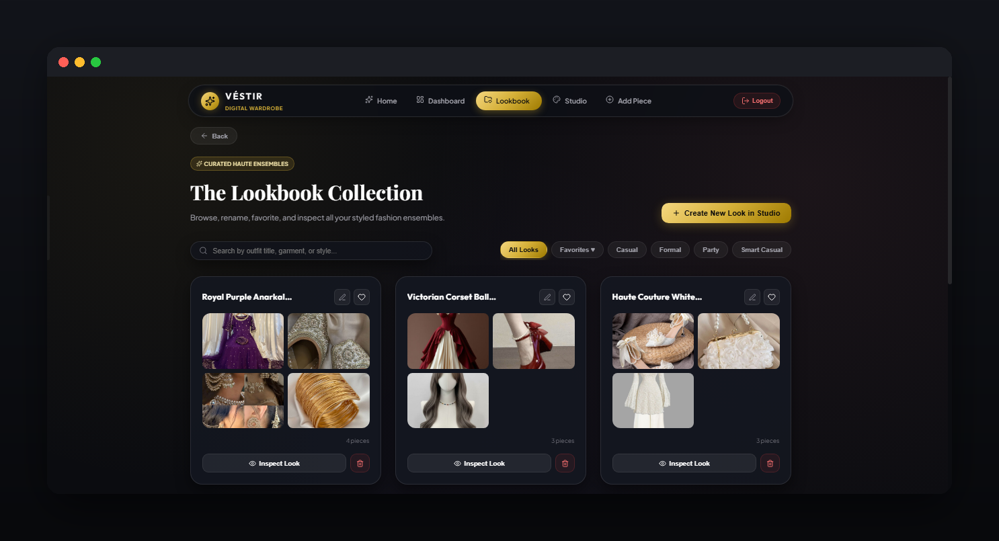

# 👗 Virtual Wardrobe

A web app for digitizing your closet — catalog your clothes, build outfits, plan them on a calendar, and get outfit suggestions based on the weather.

🔗 **Live App:** [wardrobe-j46j-vert.vercel.app](https://wardrobe-j46j-vert.vercel.app/)

## ✨ Features

- **Wardrobe Management** — Add, edit, and organize clothing items with photos, categories, colors, and tags (e.g. top, bottom, shoes, outerwear, accessories).
- **Outfit Builder** — Combine pieces from your wardrobe into saved outfits.
- **Calendar Planning** — Assign outfits to specific dates so you know what you're wearing in advance (or look back at outfit history).
- **Weather-Based Suggestions** — Get outfit recommendations pulled from your wardrobe based on the current or forecasted weather (temperature, rain, wind, season).
- **Search & Filter** — Quickly find items or outfits by category, color, season, or tag.

  ## 📸 Screenshots

### Home


### Dashboard


### Add Wardrobe Piece


### Lookbook


## 🧱 Tech Stack

| Layer          | Tech                                             |
|----------------|---------------------------------------------------|
| Frontend       | React (JSX components, React Router)              |
| Backend        | Node.js/Express (`backend/`)                      |
| Auth           | Token-based auth (`setAuthToken.js`, `PrivateRoute.js`) |
| Deployment     | Vercel                                            |
| Weather Data   | Weather API (e.g. OpenWeatherMap) — for outfit suggestions |

> Update the Database and Image Storage rows below to match what your `backend/` actually uses.

| Database       | *(add: PostgreSQL / MongoDB / etc.)*             |
| Image Storage  | *(add: Cloudinary / S3 / local)*                 |

## 📂 Project Structure

```
Virtual-Wardrobe/
├── backend/                    # Backend server (API, DB models, auth)
├── build/                      # Production build output
├── public/                     # Static assets
├── src/
│   ├── components/
│   │   ├── AddItem.jsx         # Form to add a new garment to the wardrobe
│   │   ├── CreateOutfit.jsx    # Combine items into a new outfit
│   │   ├── Dashboard.jsx       # Main dashboard / overview
│   │   ├── HomePage.jsx        # Landing page
│   │   ├── Login.js            # Login form
│   │   ├── MyOutfits.js        # List of saved outfits
│   │   ├── Navbar.js           # Top navigation
│   │   ├── OutfitDetail.js     # Single outfit detail view (garment gallery + info)
│   │   ├── PrivateRoute.js     # Route guard for authenticated pages
│   │   ├── Signup.js           # Signup form
│   │   └── Wardrobeltem.jsx    # Single wardrobe item card
│   ├── utils/
│   │   └── setAuthToken.js     # Attaches/removes auth token on requests
│   ├── App.js                  # Root component
│   ├── AppRouter.jsx           # App route definitions
│   ├── index.css               # Global styles
│   └── index.js                # Entry point
├── .env                        # Environment variables
├── .gitignore
├── package.json
├── package-lock.json
├── vercel.json                 # Vercel deployment config
└── README.md
```

## 🚀 Getting Started

### Prerequisites

- Node.js (v18+)
- A database instance (PostgreSQL/MongoDB)
- An API key from a weather provider (e.g. [OpenWeatherMap](https://openweathermap.org/api))

### Installation

```bash
git clone https://github.com/your-username/virtual-wardrobe.git
cd virtual-wardrobe
npm install
```

### Environment Variables

Create a `.env` file based on `.env.example`:

```env
DATABASE_URL=your_database_connection_string
WEATHER_API_KEY=your_weather_api_key
IMAGE_UPLOAD_KEY=your_image_storage_key
NEXTAUTH_SECRET=your_auth_secret
```

### Run Locally

```bash
npm run dev
```

Visit `http://localhost:3000` in your browser.

## 🧠 How It Works

### Adding Items
Upload a photo of a clothing piece and tag it with category, color, season, and warmth level (e.g. light, medium, heavy).

### Building Outfits
Select multiple items from your wardrobe and save them as a named outfit (e.g. "Casual Friday", "Rainy Commute").

### Calendar Assignment
Drag (or select) an outfit onto a calendar date to plan what you'll wear ahead of time.

### Weather-Based Suggestions
The app fetches the forecast for a chosen date/location and filters your wardrobe/outfits by:
- Temperature range → matches item warmth level
- Precipitation → prioritizes waterproof/rain-friendly items, deprioritizes suede/delicate fabrics
- Wind → suggests windbreakers/jackets when applicable
- Season tags → filters seasonally appropriate pieces

If no saved outfit fits well, it suggests a fresh combination from individual items matching the conditions.

## 📄 License

MIT License — feel free to use and modify.
